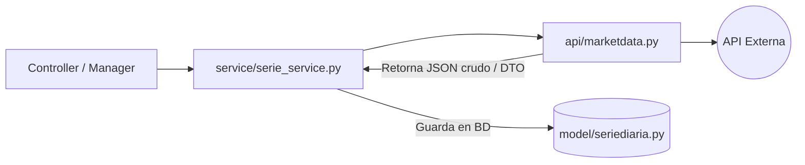

# ESPECIFICACIONES GENERALES DEL PAQUETE `api/`

Este directorio contiene las integraciones y wrappers para interactuar con proveedores y APIs externas de datos financieros y de mercado (cotizaciones de acciones, opciones financieras, tipos de cambio y stock splits).

---

## 1. Módulos y Clases de Integración

### 1.1. Alphavantage (`api/Alphavantage.py`)
* **Clase**: `Alphavantage`
* **Propósito**: Integración con la API de Alphavantage para obtener tipos de cambio y series de precios diarias/semanales/mensuales de renta variable.
* **Configuración requerida**: `ALPHAVANTAGE_KEY` y `ALPHAVANTAGE_ENDPOINT` (en `current_app.config`).
* **Métodos principales**:
  * `fx_daily(self, params={})`: Retorna tipos de cambio diarios según parámetros suministrados.
  * `get_daily_data_since(self, symbol, since)`: Obtiene datos históricos de precios de un ticker desde una fecha determinada. Los datos son parseados utilizando la clase `AlphavantageDailyResponse` de `schemas`. Retorna la última cotización y la lista completa.
  * `get_last_intraday(self, args={})`: Retorna la última cotización intradía en intervalos de 1 minuto.
  * `get_last_daily_quote(self, args={})`: Retorna la última cotización diaria para un símbolo dado.
  * `time_series_weekly_adjusted(self, args={})`: Retorna series históricas de precios ajustadas semanalmente.
  * `time_series_monthly_adjusted(self, args={})`: Retorna series históricas de precios ajustadas mensualmente.

---

### 1.2. Tiingo (`api/Tiingo.py`)
* **Clase**: `Tiingo`
* **Propósito**: Consulta rápida de cotizaciones intradía y de fin de día (EOD) usando la API de Tiingo.
* **Configuración requerida**: `TIINGO_KEY` (en `app.config`).
* **Métodos principales**:
  * `last_price(self, args={})`: Consulta del precio en tiempo real del ticker especificado (por defecto consulta `'ibm'`).
  * `historical_intraday(self, args={})`: Obtiene precios históricos intradía con frecuencia configurable (por defecto resampleado a `'5min'`).

---

### 1.3. Financial Modeling Prep (`api/fmp.py`)
* **Clase**: `FinancialModelingGrepAPI`
* **Propósito**: Consulta de splits de acciones históricos usando Financial Modeling Prep.
* **Configuración requerida**: `FINANCIAL_MODELING_GREP_ENDPOINT` y `FINANCIAL_MODELING_GREP_API_TOKEN` (en `app.config`).
* **Métodos principales**:
  * `stock_split(self, cod_symbol)`: Devuelve la lista completa de eventos de splits históricos registrados para un ticker de acción específico.

---

### 1.4. IEX Cloud (`api/iexcloud.py`)
* **Clase**: `iexcloud`
* **Propósito**: Integración legacy exhaustiva con IEX Cloud para precios intradía, históricos, tipos de cambio y metadatos de contratos de opciones.
* **Configuración requerida**: `IEXCLOUD_KEY` e `IEXCLOUD_ENDPOINT` (en `app.config`).
* **Métodos principales**:
  * `get_last_intraday(self, args={})`: Última cotización del día para un símbolo (retorna un DTO `Quote`).
  * `get_last_quote(self, args={})`: Wrapper que decide si retornar cotizaciones de acciones/ETFs (`get_quote`) u opciones financieras (`get_option_eod_data`).
  * `get_contracts(self, cod_symbol, fch_expiracion)`: Retorna la lista de símbolos de contratos de opciones disponibles para un subyacente y fecha de expiración dados.
  * `get_quote(self, args={})`: Obtiene la cotización básica en tiempo real de una acción.
  * `get_option_eod_data(self, cod_opcion)`: Parsea un código de opción estructurado (ej. strike, sentido call/put, expiración) y descarga sus cotizaciones de fin de día correspondientes.
  * `get_historical_prices(self, args={})`: Obtiene precios en intervalos o rangos (ej. 5d, 1m, 1y).
  * `fx_historical(self, params={})`: Wrapper de tipos de cambio históricos (USDPEN por defecto).
  * `symbols(self, params={})` y `etf_symbols(self, params={})`: Listado de tickers disponibles en el proveedor.
* **Clases Auxiliares**:
  * `ProfundidadHelper`: Traduce rangos y códigos de profundidad temporales (ej. `"3m"`, `"1y"`, `"ytd"`) a objetos tipo `date`.
  * `RangoHelper`: Evalúa rangos admisibles de fechas según la configuración permitida en `IEXCLOUD`.

---

### 1.5. MarketData (`api/marketdata.py`)
* **Clase**: `MarketDataAPI`
* **Propósito**: Consulta de cotizaciones, velas históricas (OHLC) y cadenas de opciones a través de MarketData API.
* **Configuración requerida**: `MARKETDATA_ENDPOINT` y `MARKETDATA_API_TOKEN` (en `app.config`).
* **Métodos principales**:
  * `get_bulk_quotes(self, cod_symbol_list=[])`: Obtiene cotizaciones masivas simultáneas para una lista de tickers.
  * `quote(self, cod_symbol)`: Obtiene la cotización extendida de un único activo.
  * `get_options_chain(self, cod_subyacente=None, fch_expiracion=None)`: Descarga y estructura la cadena de opciones de un subyacente (Strike, Expiración, Lado Call/Put, Símbolo).
  * `stock_prices(cod_symbol_list=[])` *(Estático)*: Consulta de precios actuales masivos.
  * `candles(cod_symbol, interval="1D", start_date="", end_date="")` *(Estático)*: Retorna velas históricas de precios configurando intervalos temporales.

---

### 1.6. MarketStack (`api/marketstack.py`)
* **Clase**: `MarketStackAPI`
* **Propósito**: Consulta de precios históricos y de fin de día (EOD) utilizando la API de MarketStack.
* **Configuración requerida**: `MARKETSTACK_ENDPOINT` y `MARKETSTACK_API_TOKEN` (en `app.config`).
* **Métodos principales**:
  * `get_intraday_latest(self, cod_symbol)`: Última cotización intradía registrada.
  * `get_historical_data(symbols, fch_desde, fch_hasta)` *(Estático)*: Consulta masiva de datos históricos EOD para uno o más símbolos.
  * `get_ticketlist(search="")` *(Estático)*: Búsqueda y listado de tickers disponibles en la plataforma de datos.

---

### 1.7. Massive API (`api/massive.py`)
* **Clase**: `MassiveAPI`
* **Propósito**: Integración con Massive API para consulta de agregados y velas personalizadas de índices y tickers en tiempo real.
* **Configuración requerida**: `MASSIVE_ENDPOINT` y `MASSIVE_API_TOKEN` (en `current_app.config`).
* **Métodos principales**:
  * `custom_bars(self, indices_ticker=None, multiplier=None, timespan=None, from_date=None, to_date=None, sort=None, limit=None, args=None)`: Descarga agregaciones de velas OHLC personalizadas (ej. intervalo por minuto, hora o día) para índices bursátiles y tickers bajo el patrón `/v2/aggs/ticker/I:{ticker}/range/...`.

---

### 1.8. Interactive Brokers (`api/ibkr.py`)
* **Clase**: `InteractiveBrokersClient`
* **Propósito**: Integración con Interactive Brokers para consulta de datos de mercado en tiempo real.
* **Configuración requerida**: 
    * Variables de Entorno: `IBKR_INTERACTIVE_BROKERS_ENDPOINT`
    * Secrets: Para retail no tiene
    * Software Adicional: Para clientes retail se requiere **Client Portal Gateway** cuyo enlace es: https://ibkrcampus.com/docs/web-api/web-api-v-1-0-documentation/client-portal-gateway/how-to-download-and-run-the-gateway/download-and-unzip-the-client-portal-api-gateway
* **Endpoints**
  * GET /trsrv/all-conids: 
    * Información: Este endpoint devuelve una lista de todos los CONIDs disponibles en la plataforma de Interactive Brokers, este endpoint es muy útil para obtener el conid de un ticker.
    * documentation: https://ibkrcampus.com/docs/web-api/web-api-v-1-0-documentation/client-portal-api-endpoints/market-data/market-data#get-all-conids
  * GET /marketdata/snapshot: 
    * Información: Este endpoint devuelve una instantánea del mercado para un ticker especificado.
    * documentation: https://ibkrcampus.com/docs/web-api/web-api-v-1-0-documentation/client-portal-api-endpoints/market-data/market-data#snapshot-market-data

* **Métodos principales**:
  * `get_last_intraday(self, args={})`: Obtiene la última cotización intradía del ticker especificado.

## 2. Flujo de Datos Típico

Las clases del paquete `api/` son consumidas principalmente por los **Services** (`service/`) y **Managers** (`controller/`) para poblar bases de datos temporales, actualizar series diarias o calcular el valor actual de mercado (Mark-to-Market) de las tenencias vivas:

