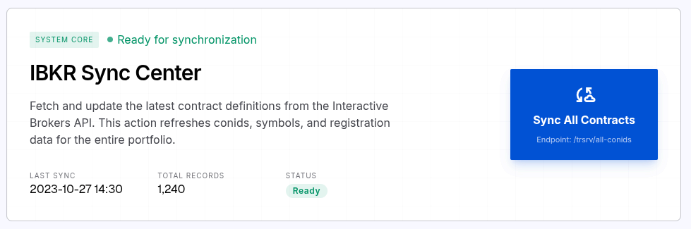

# UI Specification: IBKR Contracts Page

## 1. Contexto & Propósito

Es el front para cargar los /trsrv/all-conids de interactive brokers, los symbols/tickers tienen aparte del nemonico tienen un identificador númerico (contract) está página va a servir para cargar esos datos.

referencia: https://www.interactivebrokers.com/campus/ibkr-api-page/cpapi-v1/#trsrv-conid-contract

## 2. Layout & Jerarquía Visual

